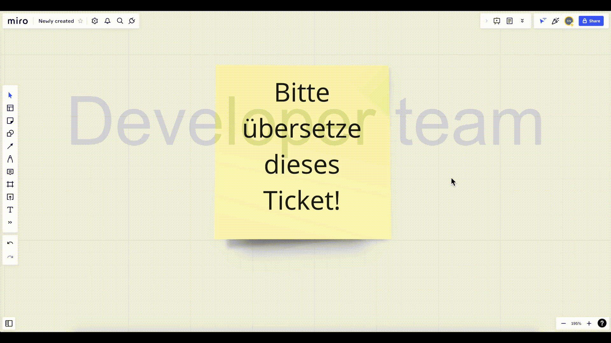

# Miro Board Translator
<!-- section: Introduction -->
<!-- Describe briefly what your software is. What problem does it solve? At what target audience is it aimed? -->
This is a miro plugin that translates items of miro boards using [DeepL](https://deepl.com). If you just want to install it you can use the following [link](https://miro.com/oauth/authorize/?response_type=code&client_id=3458764525398176649&redirect_uri=%2Fconfirm-app-install%2F).



## How to use
<!-- section: Overview -->
<!-- Give an architectural overview of your software. Is is interesting for other developers, who wants to catch on and want to developer features or fix bugs of your software. Do not go into too much detail. There are other documents for this. -->
When you open the plugin for the first time, you need to add a deepl auth key. Register at [deepl.com] (https://www.deepl.com/pro?cta=menu-pro) and choose the Deepl API Free plan, which is free. This is sufficient for most use cases as it provides 500000 characters per month for free. You will be given an authentication key, which you enter on the Settings tab. On the left side of the screen you will find a toolbar. Click the "More" icon (two arrows pointing to the right), which opens a panel. Look for the Miro Board Translator app and click on it. This will open the app panel. Select the Settings tab and enter your auth key. Select the target language. DeepL automatically detects the source language. 

Then select the items you want to translate and click the Translate button on the Plugin tab.

## Development
<!-- section: Development -->
<!-- If you software is developed within a team you shhould include this section. Describe how to setup thhe project. Include dependencies, conventions and other things to know in order to start developing. In short: After reading this section everyone should be able to develop this piece of software. -->
<!--
Possible subsections

### How to setup and run this project
### Commit messages
### How to publish a release
### Tests
-->

### How to setup and run this project
* Checkout this project
* Run `npm i` to install dependencies
* Run `npm run start` to start application in development mode (localhost: 3000)
* Setup Miro app and follow steps (see [here](https://developers.miro.com/docs/build-your-first-hello-world-app#step-2-create-a-developer-team-in-miro))

### Commit messages
We enforce the conventional commit message style. This allows us to generate a changelog based on commit messages. When installing dependencies for this project husky webhooks are installed to check your commit message style before you commit. For a more detailed view on how to write commit messages see: [here](https://www.conventionalcommits.org/en/v1.0.0/#summary)].

## Changelog
<!-- section: Changelog --> 
<!-- Describe that changes made to the software by version. Note that this should be done automatically. -->

## Contributing
<!-- section: Contributing -->
<!-- Describe what action one should take in order to contribute. Does a certain styleguide has to be adhered. How can one apply changes (i.e. push vs. pull request)? -->
Bug reports and pull requests are welcome on GitHub at https://github.com/dasheck0/miro-board-translator/issues. This project is intended to be a safe, welcoming space for collaboration, and contributors are expected to adhere to the Contributor Covenant code of conduct.

## License
<!-- section: License -->
<!-- Describe the license under which your software is published. Note that an unlicensed piece of software is most likely never used. So do not skip tihs part! -->
```
MIT License Copyright (c) 2022 Stefan Neidig

Permission is hereby granted, free
of charge, to any person obtaining a copy of this software and associated
documentation files (the "Software"), to deal in the Software without
restriction, including without limitation the rights to use, copy, modify, merge,
publish, distribute, sublicense, and/or sell copies of the Software, and to
permit persons to whom the Software is furnished to do so, subject to the
following conditions:

The above copyright notice and this permission notice
(including the next paragraph) shall be included in all copies or substantial
portions of the Software.

THE SOFTWARE IS PROVIDED "AS IS", WITHOUT WARRANTY OF
ANY KIND, EXPRESS OR IMPLIED, INCLUDING BUT NOT LIMITED TO THE WARRANTIES OF
MERCHANTABILITY, FITNESS FOR A PARTICULAR PURPOSE AND NONINFRINGEMENT. IN NO
EVENT SHALL THE AUTHORS OR COPYRIGHT HOLDERS BE LIABLE FOR ANY CLAIM, DAMAGES OR
OTHER LIABILITY, WHETHER IN AN ACTION OF CONTRACT, TORT OR OTHERWISE, ARISING
FROM, OUT OF OR IN CONNECTION WITH THE SOFTWARE OR THE USE OR OTHER DEALINGS IN
THE SOFTWARE.
```